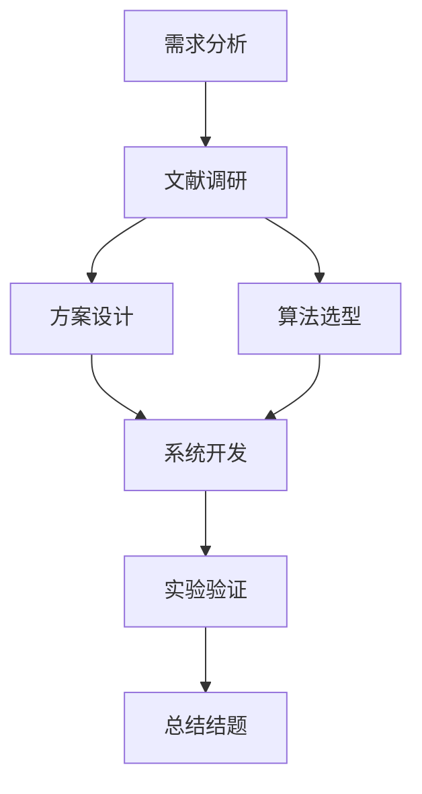
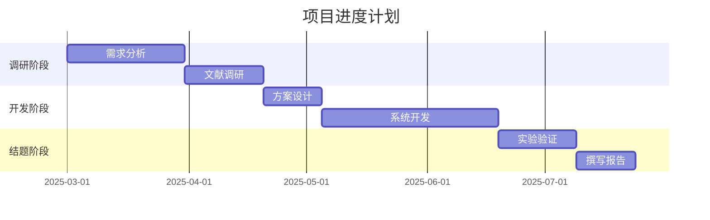

# 申报书 AI 生成服务平台 · 架构设计

> 版本：v1.0 · 2026-07-26
> 目标：用户填信息 → AI 生成图文并茂申报书 → 下载 .docx/PDF

---

## 目录

1. [系统总览](#1-系统总览)
2. [用户流程](#2-用户流程)
3. [技术架构](#3-技术架构)
4. [核心模块设计](#4-核心模块设计)
5. [图片生成策略](#5-图片生成策略)
6. [API 接口设计](#6-api-接口设计)
7. [成本分析](#7-成本分析)
8. [MVP 路线图](#8-mvp-路线图)
9. [目录结构](#9-目录结构)
10. [风险与应对](#10-风险与应对)

---

## 1. 系统总览

### 1.1 一句话

> 一个 Web 服务平台：用户选择竞赛类型 → 填写基本信息 → AI 自动生成图文并茂的申报书 → 下载 Word 文档。

### 1.2 核心价值

| 角色 | 痛点 | 本方案解决 |
|---|---|---|
| 文科生 / 非技术用户 | 不会用 GitHub，看不懂 clone/npx | 打开网页填信息，点下载 |
| 所有学生 | 写申报书不知道结构、格式、评审标准 | AI 内置 35 个赛道的领域知识 |
| 所有学生 | 没时间做技术路线图、甘特图 | AI 自动生成图表 |
| 你 | 项目有内容但缺变现路径 | 可做成付费服务 |

### 1.3 设计原则

- **零门槛**：用户不需要装任何软件，打开浏览器即可
- **低成本**：文本用 DeepSeek API（~0.05元/份），图片尽量用免费方案
- **可扩展**：新增一个赛道 = 加一个 SKILL.md + 配置，不改代码
- **合规安全**：用户数据不持久化，生成后即删

---

## 2. 用户流程

```
用户打开网页
  │
  ├─ Step 1: 选择申报类型
  │   (35 个赛道，分类展示，搜索过滤)
  │
  ├─ Step 2: 填写信息
  │   ├─ 方式 A：对话式（AI 一问一答采集）
  │   └─ 方式 B：表单式（一次性填完）
  │
  ├─ Step 3: 点击生成
  │   (等待 30-60 秒)
  │
  ├─ Step 4: 预览 + 下载
  │   ├─ 在线预览（Markdown 渲染）
  │   ├─ 下载 .docx（Word 文档，含排版+图片+表格）
  │   └─ 下载 PDF（可选）
  │
  └─ 完成
```

### 2.1 对话式信息采集（推荐）

AI 根据所选赛道的 SKILL.md 中的「信息采集清单」逐轮提问：

```
AI: 你的专业排名是多少？前百分之几？
用户: 1/87
AI: 你有参加过国家级竞赛吗？请提供竞赛名称、奖项等级和时间。
用户: 数学建模国赛，国家二等奖，2025年5月
...
```

### 2.2 表单式信息采集（快速）

用户一次性填写所有字段，适合已经准备好材料的用户。

---

## 3. 技术架构

### 3.1 整体架构图

```
┌─────────────────────────────────────────────────────────────────┐
│                        前端（Next.js）                            │
│  ┌──────────┐  ┌──────────┐  ┌──────────┐  ┌──────────────┐     │
│  │ 赛道选择页  │  │ 信息采集页  │  │ 生成预览页  │  │ 下载页       │     │
│  └─────┬────┘  └────┬─────┘  └────┬─────┘  └──────┬───────┘     │
│        └────────────┴──────────────┴───────────────┘              │
│                          │ HTTP/SSE                               │
└──────────────────────────┼────────────────────────────────────────┘
                           │
┌──────────────────────────┼────────────────────────────────────────┐
│                   后端（FastAPI）                                  │
│  ┌─────────────────────────────────────────────────────────────┐  │
│  │                    API 网关层                                 │  │
│  │  POST /generate     POST /preview    GET /types              │  │
│  └─────────────────────────┬───────────────────────────────────┘  │
│                            │                                      │
│  ┌─────────────────────────┼───────────────────────────────────┐  │
│  │                    业务逻辑层                                 │  │
│  │  ┌───────────────┐  ┌──────────────┐  ┌────────────────┐   │  │
│  │  │ 赛道路由引擎     │  │ 信息采集器     │  │ 内容生成器      │   │  │
│  │  │ dispatcher.py  │  │ collector.py  │  │ generator.py   │   │  │
│  │  └───────┬───────┘  └──────┬───────┘  └───────┬────────┘   │  │
│  │          │                 │                   │            │  │
│  │          ▼                 ▼                   ▼            │  │
│  │  ┌───────────────┐  ┌──────────────┐  ┌────────────────┐   │  │
│  │  │ SKILL.md 知识库  │  │ 图片生成器     │  │ 文档组装器      │   │  │
│  │  │ 35 个赛道       │  │ image_gen.py │  │ assembler.py   │   │  │
│  │  └───────────────┘  └──────┬───────┘  └───────┬────────┘   │  │
│  └────────────────────────────┼──────────────────┼─────────────┘  │
│                               │                  │                │
│  ┌────────────────────────────┼──────────────────┼─────────────┐  │
│  │                    外部 API 层                               │  │
│  │  ┌──────────────────┐  ┌──┴──────────┐  ┌───┴───────────┐  │  │
│  │  │ DeepSeek API     │  │ Mermaid.js  │  │ DALL-E 3 API  │  │  │
│  │  │ (文本生成)        │  │ (流程图/甘特图)│  │ (概念图/封面)   │  │  │
│  │  └──────────────────┘  └─────────────┘  └───────────────┘  │  │
│  └─────────────────────────────────────────────────────────────┘  │
└────────────────────────────────────────────────────────────────────┘
```

### 3.2 技术选型

| 层 | 技术 | 选型理由 |
|---|---|---|
| **前端框架** | Next.js 14 (App Router) | 你正在学，SSR 对 SEO 友好 |
| **UI 组件** | shadcn/ui + Tailwind CSS | 美观、专业、快速开发 |
| **后端框架** | FastAPI | 你已配置过，Python 生态好，异步支持 |
| **文本 API** | DeepSeek API | 性价比极高，中文能力强 |
| **流程图生成** | Mermaid.js | 免费，代码生成图表，可控性高 |
| **数据图表** | matplotlib (Python) | 免费，生成饼图/柱状图/折线图 |
| **概念图生成** | DALL-E 3 API | 按需调用，仅封面等场景使用 |
| **文档生成** | python-docx | 现有 build.py 的基础，已验证 |
| **部署** | Vercel (前端) + Railway / 云服务器 (后端) | MVP 阶段免费额度够用 |

### 3.3 数据流

```
请求 → 赛道匹配 → 加载 SKILL.md → 信息采集 → 生成文本
                                                      │
              ┌────────────────────────────────────────┘
              ▼
        解析文本 → 提取需要图表的位置
              │
              ├─ 技术路线图 → Mermaid.js → 渲染为 PNG
              ├─ 进度甘特图 → Mermaid.js → 渲染为 PNG
              ├─ 经费饼图   → matplotlib → 渲染为 PNG
              └─ 封面图     → DALL-E 3   → 下载为 PNG
              │
              ▼
        组装文档（python-docx）
              │
              ▼
        返回 .docx 文件（或在线预览）
```

---

## 4. 核心模块设计

### 4.1 赛道路由引擎（route_engine.py）

**功能**：用户选择赛道 → 加载对应 SKILL.md 知识 → 驱动整个生成流程

```python
class RouteEngine:
    def __init__(self):
        self.skills = load_skill_index()  # 加载 index.json
    
    def get_skill(self, skill_id: str) -> Skill:
        """根据 skill_id 返回对应的 Skill 对象"""
        return Skill(
            id=skill_id,
            name=skill_id,
            sk_path=f"subskills/{skill_id}/SKILL.md",
            info_schema=self.extract_schema(skill_id)  # 从 SKILL.md 提取采集字段
        )
    
    def extract_schema(self, skill_id: str) -> dict:
        """从 SKILL.md 自动提取信息采集清单（字段名、类型、示例、追问策略）"""
        pass
```

### 4.2 文本生成器（generator.py）

**功能**：调用 DeepSeek API，将 SKILL.md 作为 System Prompt

```python
class TextGenerator:
    def __init__(self, api_key: str):
        self.client = DeepSeekClient(api_key)
    
    def generate(self, skill: Skill, user_info: dict) -> str:
        """生成申报书正文，返回 Markdown"""
        # 1. 加载 SKILL.md 作为 system prompt
        system_prompt = load_skill_md(skill.sk_path)
        
        # 2. 构建 user prompt
        user_prompt = self.build_prompt(skill, user_info)
        
        # 3. 调用 DeepSeek API
        response = self.client.chat(
            model="deepseek-chat",
            messages=[
                {"role": "system", "content": system_prompt},
                {"role": "user", "content": user_prompt}
            ],
            temperature=0.3,  # 低温度，保证内容准确
            max_tokens=8000
        )
        
        return response.content
    
    def build_prompt(self, skill: Skill, user_info: dict) -> str:
        """根据信息采集结果生成 prompt"""
        return f"""
请根据以下用户信息，按照 {skill.name} 的 SKILL.md 要求，生成完整的申报书正文。

用户信息：
{json.dumps(user_info, ensure_ascii=False, indent=2)}

要求：
1. 严格遵循 SKILL.md 中的格式和字数要求
2. 只写用户提供的信息，不编造
3. 用 Markdown 格式输出
4. 在需要插入图表的位置用标记标注，如：
   <!--CHART:技术路线图-->
   <!--CHART:经费预算饼图-->
   <!--CHART:进度甘特图-->
"""
```

### 4.3 图片生成器（image_gen.py）

**功能**：识别文本中的图表标记，调用对应引擎生成图片

```python
class ImageGenerator:
    def __init__(self):
        self.mermaid = MermaidRenderer()
        self.matplotlib = MatplotlibRenderer()
        self.dalle = DalleRenderer(api_key=config.DALLE_API_KEY)
    
    def generate(self, chart_type: str, context: dict) -> bytes:
        """根据图表类型和上下文生成图片，返回 PNG 字节流"""
        if chart_type == "技术路线图":
            return self.mermaid.render("flowchart", context)
        elif chart_type == "进度甘特图":
            return self.mermaid.render("gantt", context)
        elif chart_type == "经费预算饼图":
            return self.matplotlib.render("pie", context)
        elif chart_type == "封面图":
            return self.dalle.render(context)
        # ... 更多类型
```

### 4.4 文档组装器（assembler.py）

**功能**：将 Markdown 正文 + 图片 → .docx 文档

```python
class DocumentAssembler:
    def __init__(self):
        self.docx = DocumentAssembler()  # 基于 python-docx
    
    def assemble(self, markdown: str, images: dict[str, bytes]) -> bytes:
        """组装成 .docx 文件，返回字节流"""
        # 1. 解析 Markdown（标题、段落、表格、列表）
        # 2. 替换图表标记为实际图片
        # 3. 应用格式（字体、页边距、行距等）
        # 4. 生成 .docx
        pass
```

---

## 5. 图片生成策略

### 5.1 图片类型与生成方案

| 图片类型 | 生成方案 | 是否需要 API | 费用 | 说明 |
|---|---|---|---|---|
| **技术路线图** | Mermaid.js → flowchart | 否 | 免费 | 最常用，每个申报书必配 |
| **进度甘特图** | Mermaid.js → gantt | 否 | 免费 | 项目类必配 |
| **经费预算饼图** | matplotlib → pie | 否 | 免费 | 项目类必配 |
| **对比柱状图** | matplotlib → bar | 否 | 免费 | 可选 |
| **组织架构图** | Mermaid.js → graph | 否 | 免费 | 可选 |
| **封面图/示意图** | DALL-E 3 API | 是 | ~$0.04/张 | 1-2张/份，可控 |
| **实践照片** | 占位图 | 否 | 免费 | 留空或用户上传 |

### 5.2 Mermaid 示例

**技术路线图**（Mermaid flowchart）：



**进度甘特图**（Mermaid gantt）：



### 5.3 成本控制策略

- **90% 的图表用 Mermaid + matplotlib**（免费）
- **仅封面图/概念图用 DALL-E 3**（$0.04/张）
- 每份文档限量 1 张 AI 生成图，超出用免费方案
- 用户可自选是否启用 AI 生图（付费增值）

---

## 6. API 接口设计

### 6.1 接口列表

| 方法 | 路径 | 功能 | 请求体 | 响应 |
|---|---|---|---|---|
| GET | `/api/types` | 获取所有赛道列表 | — | `{types: [...]}` |
| GET | `/api/types/{id}/schema` | 获取某赛道的信息采集字段 | — | `{fields: [...]}` |
| POST | `/api/generate` | 生成申报书 | `{type, user_info, options}` | `{task_id}` |
| GET | `/api/tasks/{id}/status` | 查询生成进度 | — | `{status, progress}` |
| GET | `/api/tasks/{id}/download` | 下载生成的 .docx | — | 文件流 |
| GET | `/api/tasks/{id}/preview` | 在线预览（Markdown） | — | `{markdown}` |

### 6.2 生成接口详情

```
POST /api/generate
Content-Type: application/json

{
  "type": "innovation_research",     // 赛道 ID
  "user_info": {                     // 用户填写的信息
    "name": "张明",
    "major": "计算机科学与技术",
    "gpa": 3.92,
    "rank": "1/87",
    "project_title": "基于深度学习的...",
    ...
  },
  "options": {
    "format": "docx",               // docx / pdf
    "ai_image": true,               // 是否启用 AI 生成封面图
    "template": "default"           // 学校模板
  }
}

Response:
{
  "task_id": "task_xxxxx",
  "status": "processing",
  "estimated_time": 45
}
```

---

## 7. 成本分析

### 7.1 单份申报书成本

| 项目 | 方案 | 费用（元/份） |
|---|---|---|
| 文本生成 | DeepSeek API（~5000 tokens） | 0.05 |
| 流程图 | Mermaid.js（免费） | 0 |
| 数据图表 | matplotlib（免费） | 0 |
| 封面图（可选） | DALL-E 3 API（1张） | 0.3 |
| 文档组装 | python-docx（免费） | 0 |
| 服务器 | Railway Hobby ($5/月) | 分摊极低 |
| **合计（不含封面）** | | **~0.05 元** |
| **合计（含封面）** | | **~0.35 元** |

### 7.2 定价建议

| 模式 | 定价 | 利润率 | 说明 |
|---|---|---|---|
| 免费 | 3份/月 | — | 引流，让用户体验 |
| 按次 | 9.9元/份 | ~95% | 学生单次使用 |
| 包月 | 29.9元/月 | ~99% | 学期内无限使用 |
| 高校合作 | 5万元/年 | — | 打包给就业处/创新学院 |

### 7.3 盈亏平衡点

- 按次付费：每月 30 份即可覆盖服务器成本
- 包月：每月 10 个用户即可覆盖服务器成本
- 净利率：90%+（边际成本极低）

---

## 8. MVP 路线图

### Phase 1：核心链路验证（1-2 周）

**目标**：从 1 个赛道跑通全流程

| 任务 | 产出 | 工作量 |
|---|---|---|
| 搭建 Next.js 项目 + 赛道选择页面 | 前端页面 | 2 天 |
| 搭建 FastAPI 后端 + DeepSeek API 对接 | 文本生成接口 | 1 天 |
| 实现 Mermaid 流程图生成 | 技术路线图 + 甘特图 | 1 天 |
| 实现 matplotlib 图表生成 | 经费饼图 | 1 天 |
| 实现 python-docx 文档组装 | .docx 下载 | 1 天 |
| 部署到 Vercel + Railway | 线上可访问 | 1 天 |
| **MVP 完成** | **1 个赛道，可生成图文 .docx** | **~7 天** |

**选哪个赛道做 MVP**：`innovation_research`（大创创新训练，116KB，内容最完整）

### Phase 2：扩展（2-3 周）

- 增加到 5 个核心赛道（大创/挑战杯/互联网+/国奖/申请材料）
- 添加对话式信息采集
- 添加在线预览功能
- 添加 DALL-E 封面图（可选功能）

### Phase 3：完善（3-4 周）

- 35 个赛道全部接入
- 添加用户系统（免费额度管理）
- 添加支付（微信/支付宝）
- 添加学校模板适配
- 添加 PDF 导出

---

## 9. 目录结构

```
project-root/
├── frontend/                      # Next.js 前端
│   ├── app/
│   │   ├── page.tsx               # 首页（赛道选择）
│   │   ├── generate/
│   │   │   └── [type]/
│   │   │       ├── page.tsx       # 信息采集页
│   │   │       └── preview/
│   │   │           └── page.tsx   # 预览/下载页
│   │   └── api/
│   │       └── ...                # 前端代理 API
│   ├── components/
│   │   ├── SkillSelector.tsx      # 赛道选择器
│   │   ├── InfoForm.tsx           # 信息表单
│   │   ├── ChatCollector.tsx      # 对话式采集
│   │   └── DocPreview.tsx         # 文档预览
│   └── package.json
│
├── backend/                       # FastAPI 后端
│   ├── main.py                    # 入口 + 路由
│   ├── api/
│   │   ├── types.py               # 赛道列表接口
│   │   ├── generate.py            # 生成接口
│   │   └── download.py            # 下载接口
│   ├── engine/
│   │   ├── route_engine.py        # 赛道路由引擎
│   │   ├── generator.py           # 文本生成器（DeepSeek API）
│   │   ├── image_gen.py           # 图片生成器
│   │   └── assembler.py           # 文档组装器
│   ├── skills/                    # SKILL.md 知识库（软链接到原目录）
│   ├── utils/
│   │   ├── mermaid_renderer.py    # Mermaid 渲染器
│   │   ├── matplotlib_renderer.py # matplotlib 图表生成
│   │   └── dalle_renderer.py      # DALL-E 3 调用
│   └── requirements.txt
│
├── skills/                        # 原有 SKILL.md 知识库（不变）
│   └── subskills/
│       ├── innovation_research/
│       ├── national_project_eval/
│       └── ...
│
└── ARCHITECTURE.md                # 本文件
```

---

## 10. 风险与应对

| 风险 | 等级 | 应对 |
|---|---|---|
| **DeepSeek API 生成内容不够准确** | 🟠 中 | 用低温度（0.3）+ 精确的 System Prompt；MVP 阶段人工校验 |
| **Mermaid 渲染图样不够美观** | 🟡 低 | 内置配色模板，统一风格；后期可替换为付费图表服务 |
| **DALL-E 生成图片不符合预期** | 🟠 中 | 仅用于封面/概念图，不用于关键图表；使用精确的 prompt 模板 |
| **文档格式与学校要求不匹配** | 🟠 中 | 提供多套学校模板（现有 utils/schools/ 已有 5 套） |
| **合规性风险** | 🔴 高 | 首页明确声明"AI 辅助生成，用户自行核实"；提示用户修改 |
| **用户隐私（信息泄露）** | 🟠 中 | 用户数据不持久化，生成后 24 小时自动删除；使用 HTTPS |
| **API 成本超预期** | 🟡 低 | 默认关闭 AI 生图，仅作为付费增值功能 |

---

## 附录：与现有资产的复用关系

| 现有资产 | 路径 | 在服务中的角色 |
|---|---|---|
| 35 个 SKILL.md | `subskills/*/SKILL.md` | 作为 DeepSeek API 的 System Prompt |
| 35 个 build.py | `subskills/*/build.py` | 文档排版逻辑参考，重构为 assembler.py |
| 10 个 demo .docx | `examples/demos/*.docx` | 样式参考 + 效果展示 |
| 5 套学校模板 | `utils/schools/*.json` | 格式适配 |
| index.json | `index.json` | 赛道索引，直接复用 |
| dispatcher.py | `utils/dispatcher.py` | 路由逻辑参考，重构为 route_engine.py |
| docx_common.py | `utils/docx_common.py` | 文档排版工具，直接复用 |